# camp2022_lotus
스마일게이트 개발 캠프 2022 - 윈터 개발 캠프 2기 - Lotus

## 프로젝트 소개 (LOATUS)
로스트아크 게임 계정이 연동된 커뮤니티, 매칭 사이트
- 로스트아크 오픈 API를 이용한 아이템 레벨 기반 매칭
- 매칭 시스템과 채팅을 통해 플레이 타임이 유사한 유저 간 친목 도모

## 아키텍처
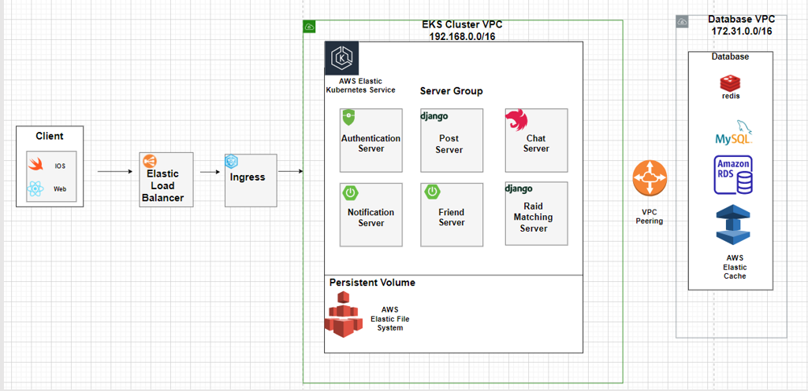

## 구현 기능 소개
- 회원가입, 인증 및 SNS로그인
- 커뮤니티 아이디와 스토브 계정 연동
- 게시판 글 작성 및 수정, 조회
- 게시판 글 상호작용(댓글, 좋아요)
- 파티 생성 및 채팅 전송
- 아이템 레벨 기반 자동 레이드 매칭
- 매칭된 유저들 간 그룹 채팅
- 친구 요청 및 수락

시연 동영상 링크: https://www.youtube.com/watch?v=yzQzJ4oKyXY
  
프로젝트 총괄 자료집:
https://github.com/sgdevcamp2022/lotus/blob/main/src/README.md
  
### 커뮤니티 아이디와 스토브 계정 연동
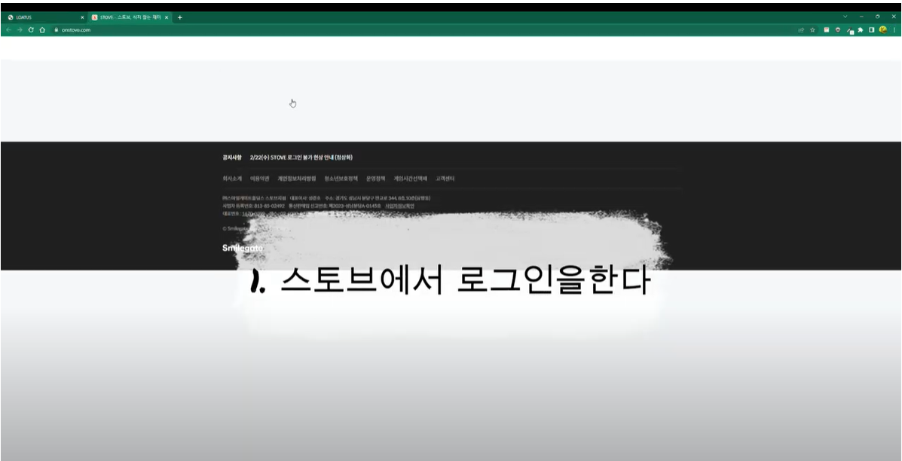
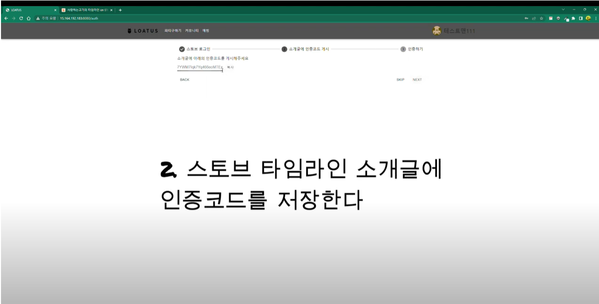
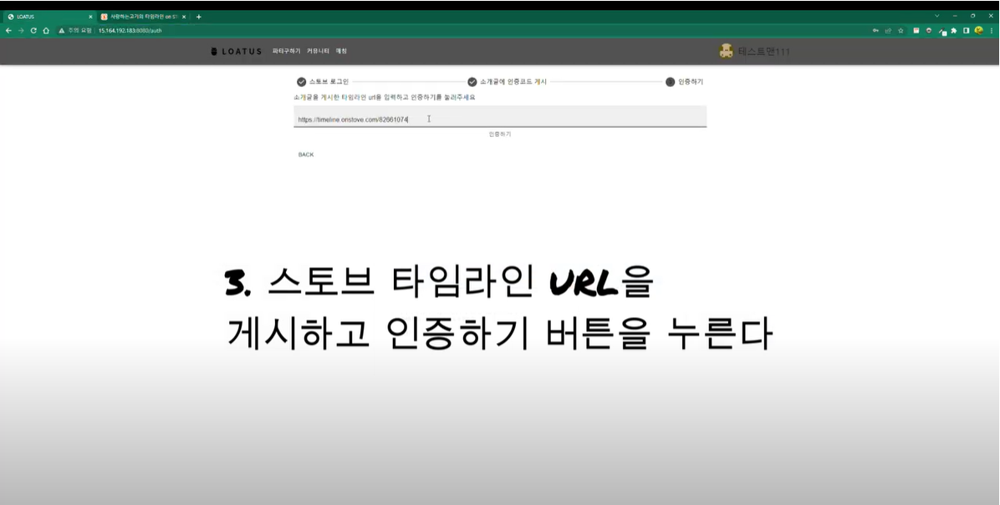
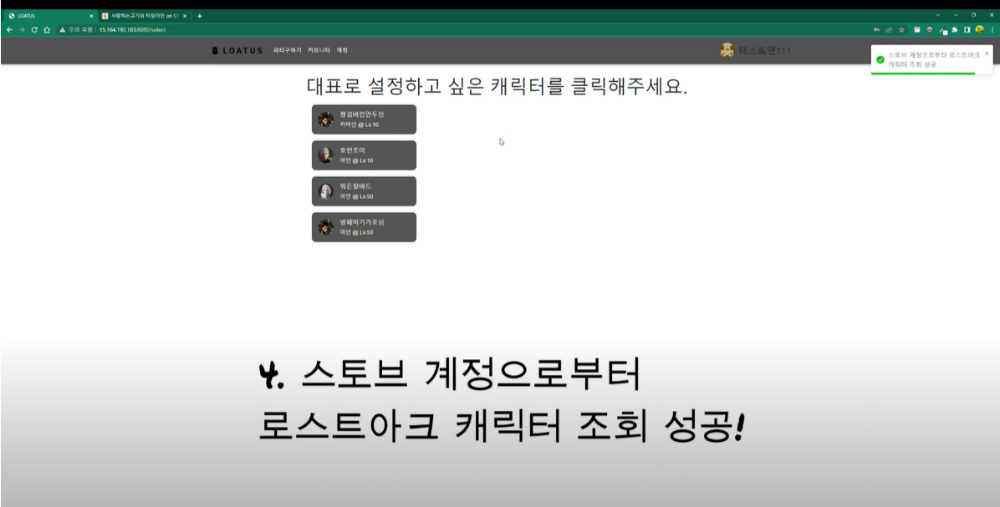
  
### 게시판 글 작성 및 수정, 조회
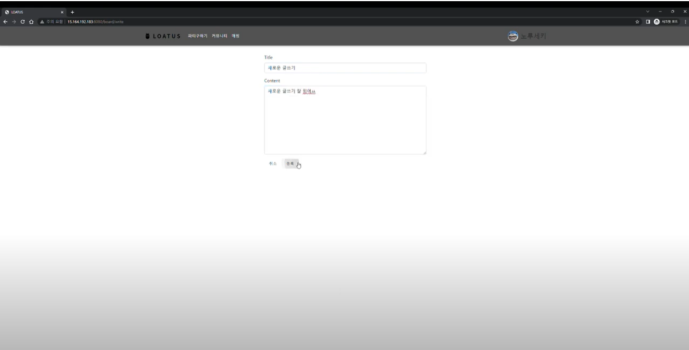
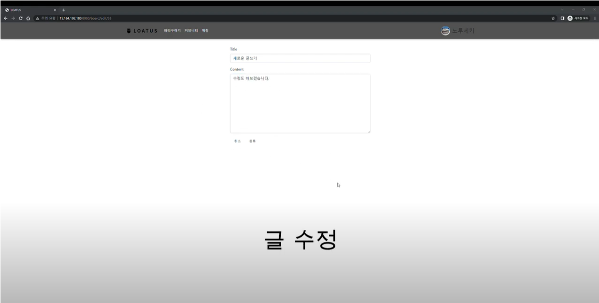
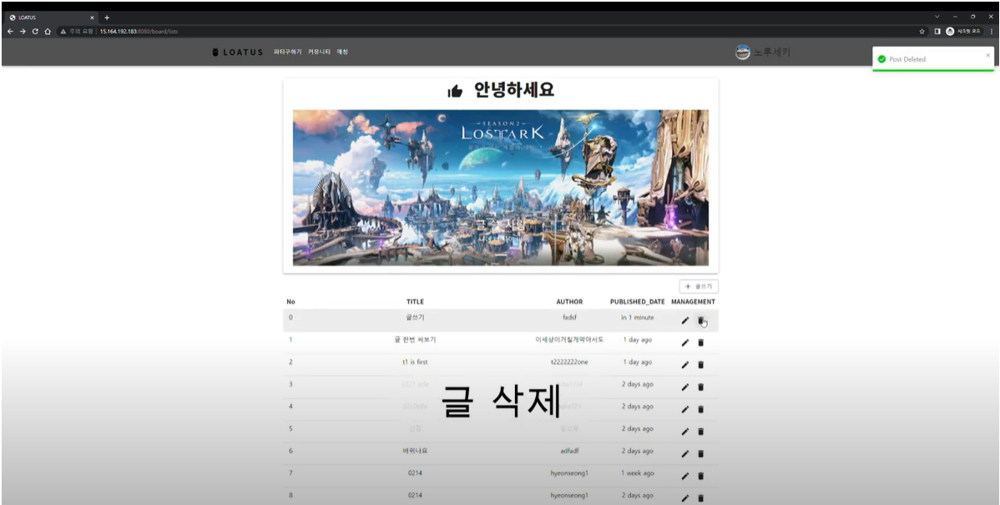
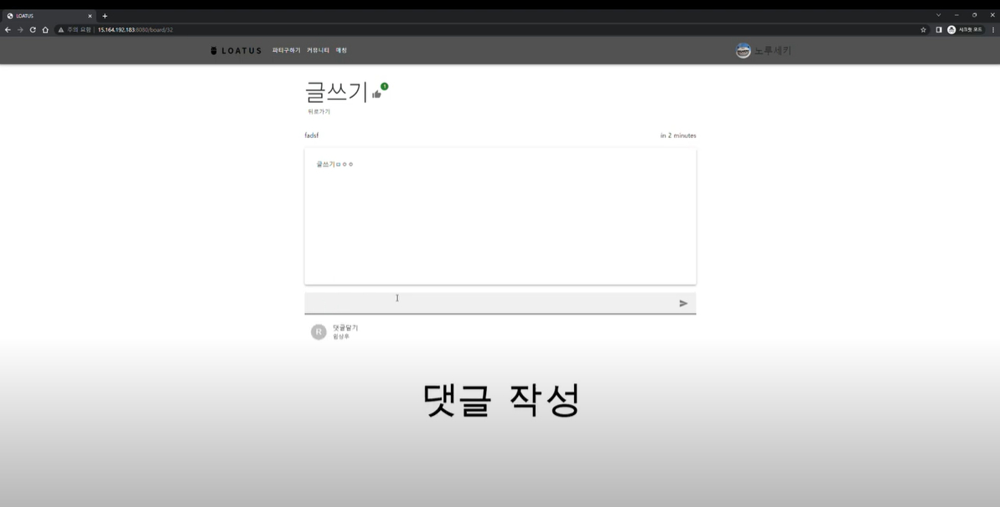
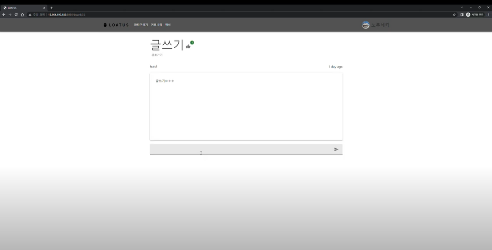
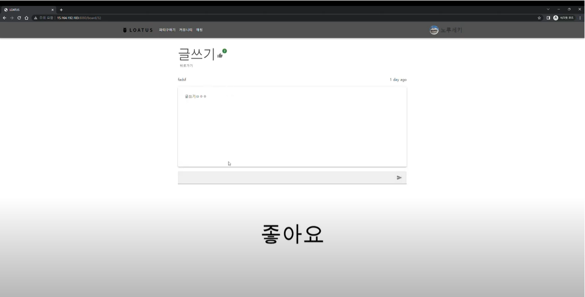
  
### 파티 생성 및 채팅 전송
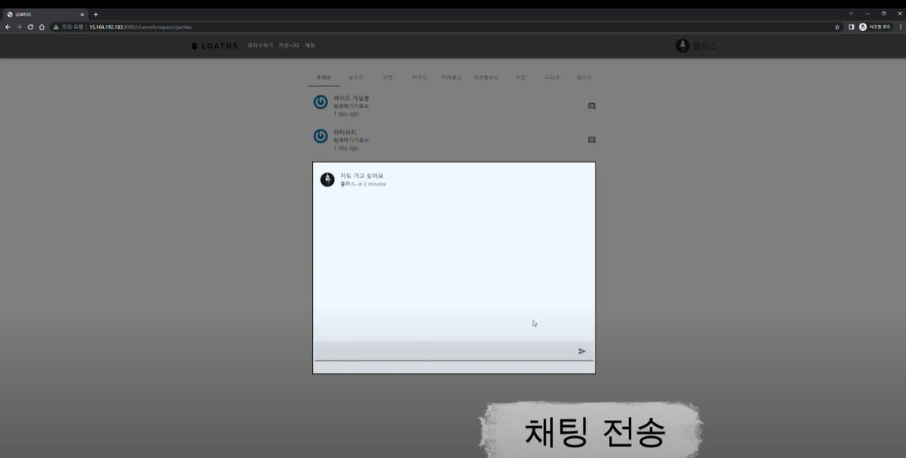
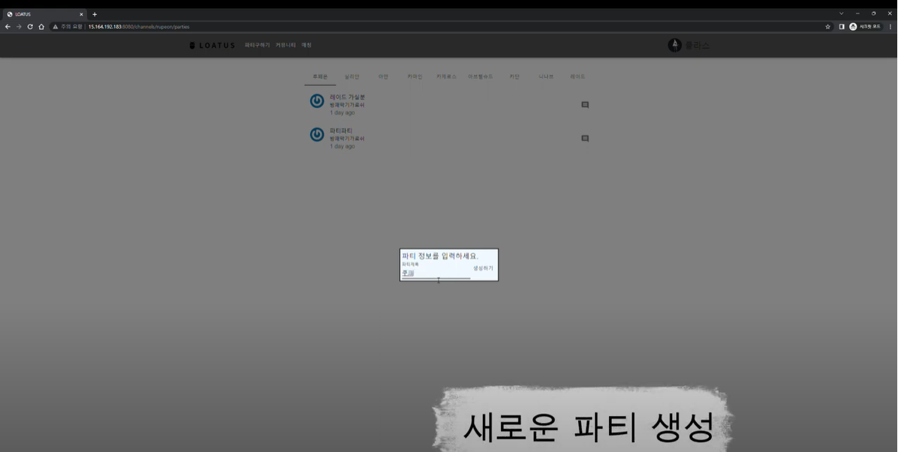
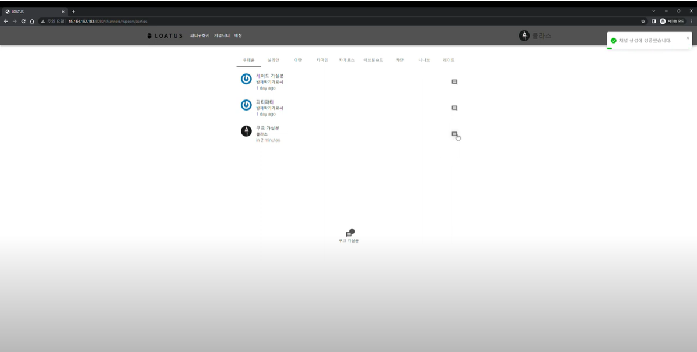
  
### 아이템 레벨 기반 자동 레이드 매칭
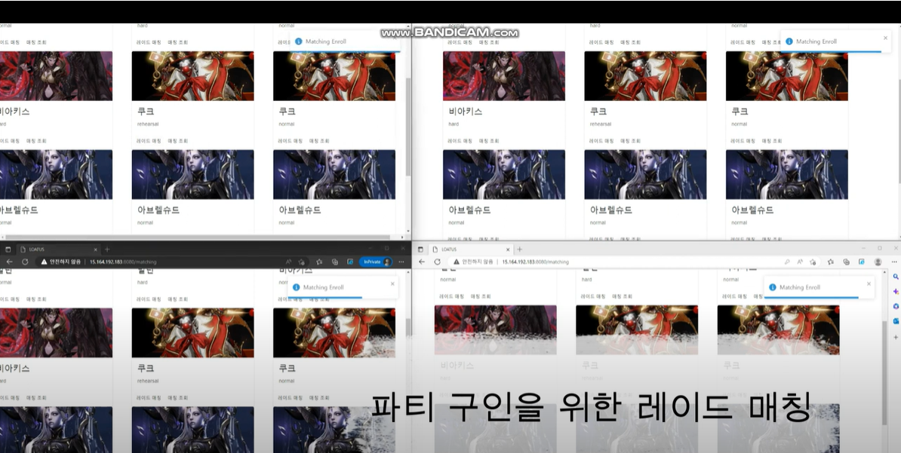
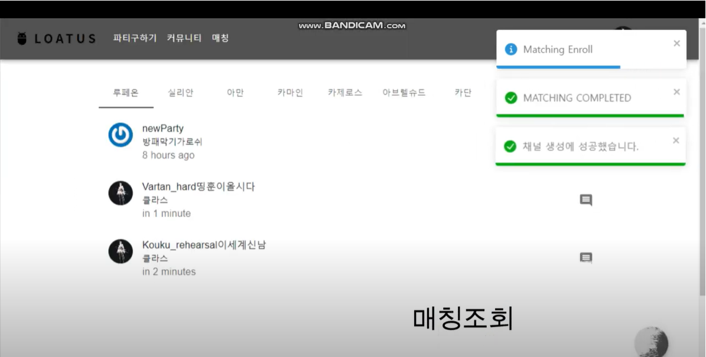

### 매칭된 유저들 간 그룹 채팅
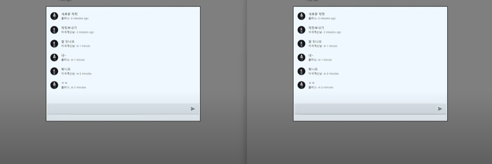

### 친구 요청 및 수락
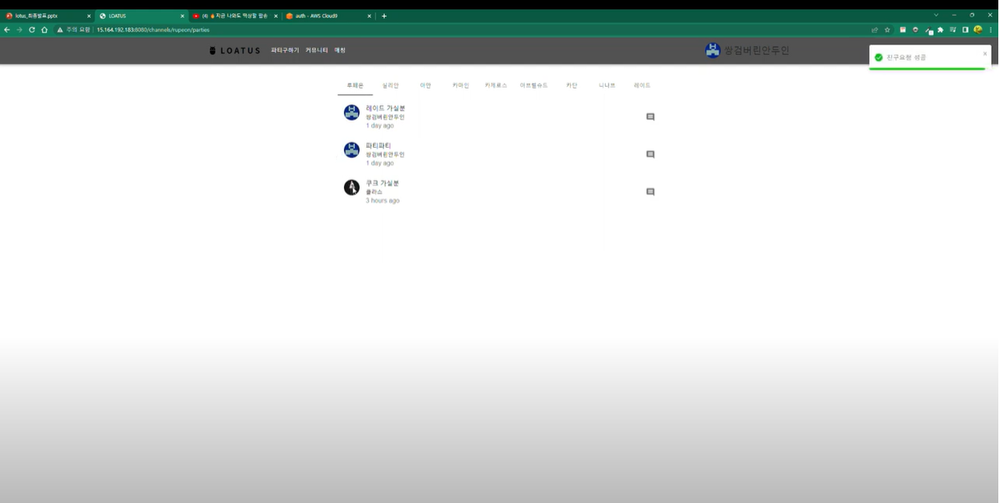

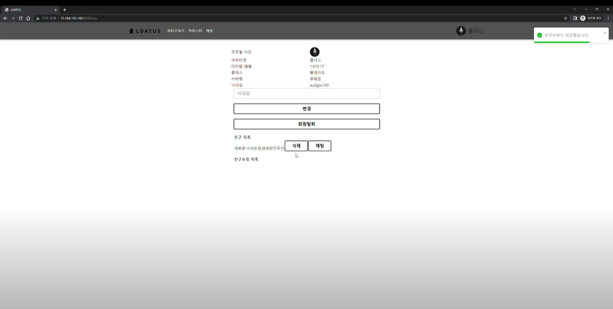