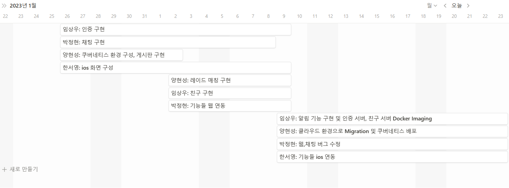

# Lotus 프로젝트 총괄 자료집
## 목차
1. 프로젝트 기획서
2. 업무분석 보고서
3. 사이트 기능 구조
4. 디렉토리 구조도
5. 데이터베이스 다이어그램(ERD)

## 1. 프로젝트 기획서
### 팀 구성 및 담당업무
- 양현성: 자동매칭 시스템 설계 및 구현 / 게시글 작성 및 관리 / 게시글 리스트 / 게시글 좋아요 / 댓글 / K8s를 이용한 백엔드 기능들의 전반적인 시스템 인프라 설계 및 구축 / AWS 클라우드 네이티브 환경으로 Migration
- 임상우:
- 박정현:
- 한서영:

### 프로젝트 개요
- ### Loatus 프로젝트
    - 관련 분야: 커뮤니티 서비스
    - 개발 기간: 2023. 01. 25 ~ 2023. 02. 23
    - 운영 체제: Linux
    - DB: MySQL, Redis
    - 사용 언어: Python, Java, JavaScript, HTML, CSS, TypeScript
    - 그 외 SW: Docker, Kubernetes, AWS Cloud(EKS(Kubernetes), RDS(MySQL), ElasticCache(Redis), EFS(NFS), VPC, EC2, Cloud9), Django,
- ### 개요
    - ### 로스트아크 게임 계정 연동을 통한 유저들의 레이드 매칭 및 친목 도모를 위한 커뮤니티 사이트

## 업무분석 보고서
- 개발 팀 이름: Lotus
- 개발 분야: 클라우드 환경에서 Kubernetes를 이용한 Django, Spring, NestJS 웹 애플리케이션 배포
- 팀 구성
    - 팀장: 양현성
    - 팀원: 임상우, 박정현, 한서영
- 목적
    - 스토브 플랫폼 연동을 통한 로스트아크 인게임 계정 정보가 연동된 커뮤니티 사이트를 만든다.
    - 레이드 파티를 찾고자 하는 유저들을 위해 기본적인 커뮤니티 기능을 제공한다.
    - 로스트아크 오픈API를 기반으로 비슷한 스펙의 유저들끼리의 자동매칭 기능을 지원한다.
- 프로젝트 개발 일정

## 사이트 기능 구조
- 게시글
    - 게시글 관련
        - 게시글 등록 및 수정
            - 게시글 등록 및 작성했던 내용을 가져와 수정할 수 있음
        - 게시글 삭제
            - 게시글 삭제하면 게시글에 있던 댓글 등 모든 게시글 관련 내용을 DB에서 삭제
        - 게시글 좋아요
            - 원하는 게시글에 좋아요를 표시할 수 있음(한 번 더 누른다면 취소할 수 있음)
    - 댓글 관련
        - 댓글 등록 및 조회: 댓글을 등록하고 게시글의 모든 댓글들을 조회할 수 있음
- 매칭
    - 매칭 관련
        - 매칭 등록
            - 다양한 레이드 매칭들 중 원하는 레이드 매칭에 등록할 수 있음. 연동된 캐릭터 정보를 바탕으로 로스트아크 오픈 API를 호출하여 입장 스펙을 만족하는지를 확인함.
            - 매칭을 등록한 유저 순으로 매칭을 잡아줌.
        - 매칭 조회
            - 원하는 레이드의 인원들이 모두 매칭 되었는지를 확인함.

## 디렉토리 구조도